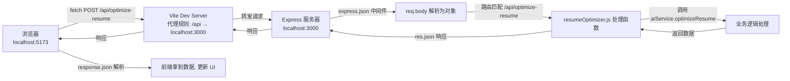

以下是根据你项目实际架构整理的 **“前端请求 → 后端响应”完整流程总结**，可作为你项目知识库的一部分。内容聚焦你曾困惑的点（代理、挂载、req/res、错误流向），并保持与你的代码一致。

---

## 一、整体架构概览

| 角色 | 技术/工具 | 端口 | 职责 |
|------|----------|------|------|
| 前端（浏览器） | Vue 3 + Vite | 5173（开发服务器） | 发送 HTTP 请求、展示 UI |
| Vite 开发服务器 | proxy 配置 | 5173 | 转发 `/api` 请求，解决跨域 |
| 后端服务器 | Express | 3001 | 接收请求、解析 body、路由分发、调用业务逻辑 |
| AI 服务层 | DeepSeek API | 外部 | 生成学习路线 / 简历优化文本 |

> 生产环境通常用 Nginx 替代 Vite proxy，但开发阶段 Vite proxy 足够。

---

## 二、一次完整请求的 11 步流程（从点击按钮到界面更新）

### 1. 前端触发请求（Vue 组件）
```js
fetch('/api/optimize-resume', {
  method: 'POST',
  headers: { 'Content-Type': 'application/json' },
  body: JSON.stringify({
    projectName: '...',
    role: '...',
    techStack: '...',
    reflection: '...'
  })
})
```
- 相对路径 `/api/optimize-resume` → 浏览器自动补全为 `http://localhost:5173/api/optimize-resume`

### 2. 浏览器发起 HTTP 请求
- 请求目标：`localhost:5173`（Vite 开发服务器）
- 请求方法：POST
- 请求体：JSON 字符串

### 3. Vite 代理拦截并转发
```js
// vite.config.ts
server: {
  proxy: {
    '/api': {
      target: 'http://localhost:3001',   // 后端真实地址
      changeOrigin: true
    }
  }
}
```
- Vite 看到路径以 `/api` 开头，**将请求原样转发**到 `http://localhost:3001/api/optimize-resume`
- **作用**：绕过浏览器的同源策略（5173 → 3001 属于不同端口）

### 4. Express 后端接收请求
- Node.js 进程监听 3001 端口
- Express 应用（`app.js`）接收到原始 HTTP 请求

### 5. 全局中间件处理（`app.js` 中配置）
```js
app.use(express.json());   // 解析 JSON body，挂载到 req.body
app.use(cors());           // 允许跨域（开发环境可不用，但保留无害）
```
- `express.json()` 读取请求体中的 JSON 字符串，转为 JS 对象 → `req.body = { projectName, role, techStack, reflection }`

### 6. 路由挂载与匹配
```js
app.use('/api', resumeOptimizerRouter);
```
- 所有以 `/api` 开头的请求，交给 `resumeOptimizerRouter` 处理（即 `resumeOptimizer.js` 导出的 router）

```js
router.post('/optimize-resume', async (req, res) => { ... });
```
- 匹配到 **POST 方法 + 路径 `/optimize-resume`**，执行后面的处理函数

### 7. 路由处理器执行
```js
let { projectName, role, techStack, reflection } = req.body;
const result = await optimizeResume(projectName, role, techStack, reflection);
```
- 从 `req.body` 提取前端发送的数据
- 调用服务层函数 `optimizeResume`

### 8. 服务层执行（可能抛出错误）
- 校验输入是否全空 → 若是，`throw new BusinessError('请至少填写一项信息')`
- 调用 DeepSeek API（`callDeepSeekAPI`）
- 解析 AI 返回的 JSON（`parseAIResponse`） → 若解析失败，`throw new SyntaxError(...)`
- 返回 `{ bullets: [...] }`

### 9. 路由层根据结果返回响应
- **成功**：`res.json({ success: true, data: result })`
- **捕获错误**：根据错误类型调用 `res.status(400/500/502).json({ success: false, message: '...' })`

### 10. Express 发送 HTTP 响应
- 将 `res` 对象中的状态码、响应头、JSON 体打包成 HTTP 响应报文
- 通过 TCP 连接发回给请求方 —— **Vite 开发服务器（127.0.0.1:5173）**

### 11. Vite 代理转发响应给浏览器
- Vite 收到来自后端的响应后，**透传**给浏览器
- 浏览器接收到响应，`fetch` 的 Promise 变为 resolved

### 12. 前端处理响应并更新 UI
```js
const result = await response.json();
if (result.success) {
  bullets.value = result.data.bullets;   // 展示优化结果
} else {
  errorMessage.value = result.message;    // 显示错误提示（如“请至少填写一项信息”）
}
```

---

## 三、关键概念速查表（针对你之前困惑的点）

| 概念 | 解释 | 在项目中的体现 |
|------|------|----------------|
| **Vite 代理** | 开发服务器把特定路径的请求转发到另一个地址，解决跨域 | `vite.config.ts` 中的 `proxy` 配置 |
| **挂载** | 将中间件或子路由绑定到某个路径前缀 | `app.use('/api', resumeOptimizerRouter)` |
| **req** | 请求对象，包含前端传来的所有信息（body、params、query等） | `req.body.projectName` |
| **res** | 响应对象，提供 `res.json()`、`res.status()` 等方法向前端返回数据 | `res.json({ success: true })` |
| **路由层** | 负责接收请求、调用服务、返回响应，不包含业务逻辑 | `resumeOptimizer.js` 中的 `router.post` |
| **服务层** | 封装 AI 调用、业务校验、错误抛出 | `aiService.js` 中的 `optimizeResume` |
| **错误流向** | 服务层抛出错误 → 路由层 catch → 路由层用 `res.status().json()` 返回前端 | `catch (err) { res.status(400).json(...) }` |

---

## 四、常见错误来源与对应 HTTP 状态码（你的代码已覆盖）

| 错误场景 | 抛出位置 | 路由层捕获后返回的状态码 |
|----------|----------|--------------------------|
| 用户四项全为空 | `optimizeResume` 中 `throw new BusinessError` | 400 Bad Request |
| AI 返回非 JSON 或格式错误 | `parseAIResponse` 中 `throw new SyntaxError` | 500 Internal Server Error |
| DeepSeek API 网络不通 / 返回 5xx | `callDeepSeekAPI` 中 `throw new Error` | 502 Bad Gateway |
| 环境变量缺失（API key） | `callDeepSeekAPI` 中检测到无 key | 502（实际是服务器配置错误） |

---

## 五、一句话记住整个流程

> **前端 fetch → Vite 代理转发 → Express 解析 body → 路由匹配 → 调用服务层 → 服务层返回或抛错 → 路由层用 res.json 返回 → 代理透传 → 前端更新界面**

你可以把这个文档保存为你项目知识库的一部分，后续遇到类似问题直接对照流程定位 bug（例如：前端没发请求检查代理、后端收不到 body 检查 `express.json()`、AI 报错检查服务层日志）。

📊 一张图总结
